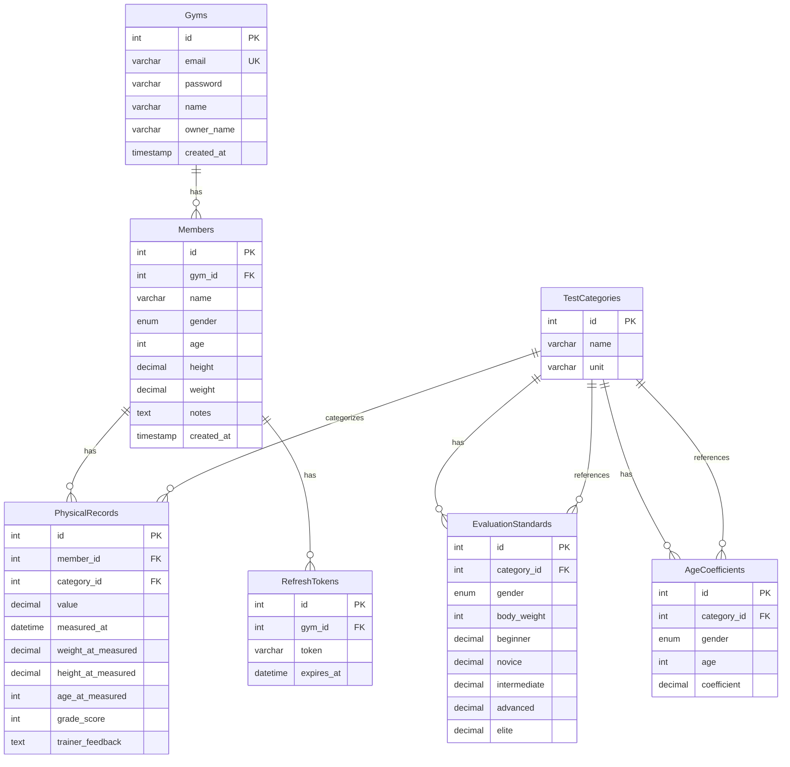

# 💪 FitSpec Backend (핏스펙)

<div align="center">


**체력 측정부터 등급 평가까지! 헬스장 회원 관리 시스템 백엔드**

[빠른 시작](#4-빠른-시작-quick-start) •
[API 문서](#9-api-엔드포인트-주요-로직-api-logic--examples) •
[등급 계산 로직](#체력-측정-결과-처리-api)

</div>

---

## 📋 목차

1. [프로젝트 소개](#1-프로젝트-소개)
2. [주요 기능](#2-주요-기능-key-features)
3. [기술 스택](#3-기술-스택-tech-stack)
4. [빠른 시작](#4-빠른-시작-quick-start)
5. [폴더 구조](#5-폴더-구조-folder-structure)
6. [ERD (데이터베이스 설계)](#6-erd-데이터베이스-설계)
7. [아키텍처 개요](#7-아키텍처-개요-architecture)
8. [모듈 상세 설명](#8-모듈-상세-설명)
9. [API 엔드포인트](#9-api-엔드포인트-주요-로직-api-logic--examples)
10. [체력 측정 결과 처리 API](#체력-측정-결과-처리-api)

---

## 1. 프로젝트 소개

**FitSpec**은 헬스장에서 회원의 체력을 측정하고, 나이와 체중을 고려하여 정확한 등급을 평가하는 시스템입니다.

백엔드 서버는 **회원 관리**, **체력 측정 결과 저장**, **나이/체중 기반 등급 계산**, **측정 이력 관리** 등 핵심 비즈니스 로직을 담당합니다.

### 🎯 주요 목표

| 목표       | 설명                                          |
| ---------- | --------------------------------------------- |
| **정확성** | 나이 계수와 체중 매칭을 통한 정확한 등급 평가 |
| **안정성** | TypeORM 트랜잭션을 통한 데이터 무결성 보장    |
| **확장성** | NestJS의 모듈 패턴을 활용하여 기능 확장 용이  |
| **보안성** | JWT 기반 인증 + Refresh Token으로 보안 강화   |

---

## 2. 주요 기능 (Key Features)

### 🔐 인증 (Authentication)

- **회원가입/로그인**: 헬스장 소유자 이메일 기반 인증, `bcrypt` 암호화
- **JWT 인증**: Access Token & Refresh Token 기반의 보안 인증 시스템
- **Guard**: 인증된 헬스장만 접근 가능한 보호된 라우트 (`JwtAuthGuard`)

### 🏋️ 회원 관리 (Members)

- **회원 등록/수정/삭제**: 헬스장별 회원 정보 관리
- **회원 조회**: 헬스장별 회원 목록 및 상세 정보 조회
- **회원 검색**: 이름으로 회원 검색 기능

### 📊 체력 측정 (Physical Records)

- **측정 결과 저장**: 5개 종목(벤치프레스, 풀업, 숄더프레스, 스쿼트, 윗몸일으키기) 측정값 저장
- **등급 자동 계산**: 나이와 체중을 고려한 정확한 등급 평가
- **측정 이력 관리**: 측정 시점의 몸무게, 키, 나이 정보 저장
- **트레이너 피드백**: 측정 시 트레이너 코멘트 저장

### 📈 등급 평가 시스템 (Evaluation Standards)

- **5단계 등급 체계**: Beginner → Novice → Intermediate → Advanced → Elite
- **나이 보정**: 나이에 따른 체력 감소를 고려한 계수 적용
- **체중 매칭**: 회원 체중과 가장 가까운 내림값의 평가 기준 사용
- **카테고리별 기준**: 운동 종목별로 다른 평가 기준 적용

### 🏢 헬스장 관리 (Gyms)

- **헬스장 등록**: 헬스장 정보 관리
- **멀티 테넌시**: 헬스장별 데이터 격리

---

## 3. 기술 스택 (Tech Stack)

### Backend Framework

| 기술           | 버전  | 설명                                          |
| -------------- | ----- | --------------------------------------------- |
| **NestJS**     | v11.x | 모듈식 아키텍처를 제공하는 Node.js 프레임워크 |
| **TypeScript** | v5.x  | 정적 타입을 지원하는 JavaScript 상위 집합     |

### Database & ORM

| 기술        | 버전   | 설명                            |
| ----------- | ------ | ------------------------------- |
| **MySQL**   | 8.x    | 관계형 데이터베이스 관리 시스템 |
| **TypeORM** | v0.3.x | TypeScript용 ORM                |

### Authentication & Security

| 기술         | 버전   | 설명                     |
| ------------ | ------ | ------------------------ |
| **Passport** | v0.7.x | Node.js 인증 미들웨어    |
| **JWT**      | -      | JSON Web Token 기반 인증 |
| **bcrypt**   | v6.x   | 비밀번호 해싱 라이브러리 |

### Data Processing

| 기술          | 버전  | 설명            |
| ------------- | ----- | --------------- |
| **xlsx**      | v0.18 | Excel 파일 처리 |
| **csv-parse** | v6.1  | CSV 파일 파싱   |

---

## 4. 빠른 시작 (Quick Start)

### 4-1. 사전 요구사항

- Node.js v20 이상
- MySQL 8.x
- npm 또는 yarn

### 4-2. 의존성 설치

```bash
npm install
```

### 4-3. 환경변수 설정

프로젝트 루트에 `.env` 파일을 생성하고 다음 변수를 설정하세요.

```env
# Server
PORT=3000
NODE_ENV=development

# Database
DB_HOST=localhost
DB_PORT=3306
DB_USERNAME=root
DB_PASSWORD=your_password
DB_DATABASE=fitspec

# JWT
JWT_SECRET=your-super-secret-jwt-key-change-this-in-production
```

### 4-4. 데이터베이스 생성

```sql
CREATE DATABASE fitspec;
```

> ⚠️ TypeORM `synchronize: true` 설정으로 엔티티 기반 테이블이 자동 생성됩니다.  
> 프로덕션 환경에서는 `synchronize: false`로 설정하고 마이그레이션을 사용하세요.

### 4-5. 개발 서버 실행

```bash
# 개발 모드 실행 (Watch 모드)
npm run start:dev

# 일반 실행
npm run start

# 프로덕션 실행
npm run build
npm run start:prod
```

---

## 5. 폴더 구조 (Folder Structure)

```
src/
├── main.ts                    # 앱 진입점 (Pipe, Filter 설정)
├── app.module.ts              # 메인 앱 모듈 (모듈 통합)
├── app.controller.ts          # 앱 컨트롤러
├── app.service.ts             # 앱 서비스
│
├── auth/                      # 🔐 인증 모듈
│   ├── auth.module.ts
│   ├── auth.controller.ts
│   ├── auth.service.ts
│   ├── dto/
│   │   ├── login.dto.ts
│   │   └── signup.dto.ts
│   └── entities/
│       └── auth.entity.ts
│
├── gyms/                      # 🏢 헬스장 모듈
│   ├── gyms.module.ts
│   ├── gyms.controller.ts
│   ├── gyms.service.ts
│   ├── dto/
│   └── entities/
│       └── gym.entity.ts
│
├── members/                   # 👤 회원 모듈
│   ├── members.module.ts
│   ├── members.controller.ts
│   ├── members.service.ts
│   ├── dto/
│   │   ├── calculate-measurements.dto.ts
│   │   └── create-member.dto.ts
│   └── entities/
│       └── member.entity.ts
│
├── physical_records/          # 📊 체력 측정 기록 모듈
│   ├── physical_records.module.ts
│   ├── physical_records.controller.ts
│   ├── physical_records.service.ts
│   ├── dto/
│   └── entities/
│       └── physical_record.entity.ts
│
├── test_categories/           # 🏋️ 운동 종목 카테고리 모듈
│   ├── test_categories.module.ts
│   ├── test_categories.controller.ts
│   ├── test_categories.service.ts
│   └── entities/
│       └── test_category.entity.ts
│
├── evaluation_standards/      # 📈 평가 기준 모듈
│   ├── evaluation_standards.module.ts
│   ├── evaluation_standards.controller.ts
│   ├── evaluation_standards.service.ts
│   └── entities/
│       └── evaluation-standard.entity.ts
│
├── age_coefficients/          # 🔢 나이 계수 모듈
│   ├── age-coefficients.module.ts
│   ├── age-coefficients.controller.ts
│   ├── age-coefficients.service.ts
│   └── entities/
│       └── age-coefficient.entity.ts
│
├── refresh_tokens/            # 🔄 리프레시 토큰 모듈
│   ├── refresh_tokens.module.ts
│   ├── refresh_tokens.controller.ts
│   └── entities/
│       └── refresh_token.entity.ts
│
├── public_physical_records/  # 📋 공개 체력 기록 모듈
│   └── ...
│
└── common/                    # 🔧 공통 유틸리티
    ├── filters/
    │   └── http-exception.filter.ts
    ├── guards/
    │   └── jwt-auth.guard.ts
    └── interceptors/
        ├── logging.interceptor.ts
        └── transform.interceptor.ts
```

---

## 6. ERD (데이터베이스 설계)



### 주요 관계 설명

| 관계                                     | 설명                           |
| ---------------------------------------- | ------------------------------ |
| `Gyms` → `Members`                       | 1:N - 한 헬스장이 여러 회원    |
| `Members` → `PhysicalRecords`            | 1:N - 한 회원이 여러 측정 기록 |
| `TestCategories` → `PhysicalRecords`     | 1:N - 한 종목에 여러 측정 기록 |
| `TestCategories` → `EvaluationStandards` | 1:N - 종목별 평가 기준         |
| `TestCategories` → `AgeCoefficients`     | 1:N - 종목별 나이 계수         |

---

## 7. 아키텍처 개요 (Architecture)

본 프로젝트는 **NestJS**의 표준 **Layered Architecture**를 따릅니다.

```
┌─────────────────────────────────────────────────────────────────┐
│                        Client (Frontend)                         │
└─────────────────────────────────────────────────────────────────┘
                                │
                                ▼
┌─────────────────────────────────────────────────────────────────┐
│                         Controller Layer                         │
│  • 요청/응답 처리 • 유효성 검사 (DTO) • 라우팅                    │
└─────────────────────────────────────────────────────────────────┘
                                │
                                ▼
┌─────────────────────────────────────────────────────────────────┐
│                          Service Layer                           │
│  • 비즈니스 로직 • 트랜잭션 처리 • 등급 계산                      │
└─────────────────────────────────────────────────────────────────┘
                                │
                                ▼
┌─────────────────────────────────────────────────────────────────┐
│                        Repository Layer                          │
│  • TypeORM Repository • 데이터베이스 쿼리                        │
└─────────────────────────────────────────────────────────────────┘
                                │
                                ▼
┌─────────────────────────────────────────────────────────────────┐
│                      Database (MySQL)                            │
└─────────────────────────────────────────────────────────────────┘
```

### 핵심 설계 패턴

1. **Controller**: 클라이언트 요청을 받아 유효성 검사 수행, Service로 전달
2. **Service**: 비즈니스 로직 수행, 트랜잭션 처리, 등급 계산
3. **Repository**: 데이터베이스와의 직접적인 통신 담당
4. **DTO**: 데이터 전송 객체로 타입 안전성 보장
5. **Entity**: 데이터베이스 테이블 매핑

---

## 8. 모듈 상세 설명

### 🔐 Auth Module

JWT 기반의 인증 시스템을 담당합니다.

| 구성요소       | 설명                        |
| -------------- | --------------------------- |
| `AuthService`  | 회원가입, 로그인, 토큰 발급 |
| `JwtAuthGuard` | 인증된 헬스장만 접근 허용   |

### 👤 Members Module

회원 관리 및 체력 측정 결과 처리 기능을 담당합니다.

- **회원 CRUD**: 회원 등록, 수정, 삭제, 조회
- **체력 측정 처리**: 측정 결과 저장 및 등급 계산
- **등급 계산 로직**: 나이 계수와 체중 매칭을 통한 정확한 등급 평가

### 📈 Evaluation Standards Module

운동 종목별 평가 기준을 관리합니다.

- **체중별 기준**: 성별, 체중, 종목별 5단계 등급 기준치
- **등급 체계**: Beginner, Novice, Intermediate, Advanced, Elite

### 🔢 Age Coefficients Module

나이에 따른 체력 감소 계수를 관리합니다.

- **나이별 계수**: 성별, 나이, 종목별 계수
- **가장 가까운 나이 매칭**: 정확한 나이가 없을 경우 가장 가까운 나이의 계수 사용

---

## 9. API 엔드포인트 주요 로직 (API Logic & Examples)

### 🔐 Auth (인증)

| Method | Endpoint        | 설명                              |
| ------ | --------------- | --------------------------------- |
| POST   | `/auth/signup`  | 회원가입 (비밀번호 bcrypt 암호화) |
| POST   | `/auth/login`   | 로그인 (AT + RT 발급)             |
| POST   | `/auth/refresh` | Access Token 갱신                 |
| POST   | `/auth/logout`  | 로그아웃 (RT 무효화)              |

### 🏢 Gyms (헬스장)

| Method | Endpoint    | 설명        |
| ------ | ----------- | ----------- |
| GET    | `/gyms`     | 헬스장 목록 |
| GET    | `/gyms/:id` | 헬스장 상세 |
| POST   | `/gyms`     | 헬스장 등록 |
| PATCH  | `/gyms/:id` | 헬스장 수정 |
| DELETE | `/gyms/:id` | 헬스장 삭제 |

### 👤 Members (회원)

| Method | Endpoint                          | 설명                |
| ------ | --------------------------------- | ------------------- |
| GET    | `/members`                        | 회원 목록 조회      |
| GET    | `/members/:id`                    | 회원 상세 조회      |
| POST   | `/members`                        | 회원 등록           |
| PATCH  | `/members/:id`                    | 회원 정보 수정      |
| DELETE | `/members/:id`                    | 회원 삭제           |
| POST   | `/members/calculate-measurements` | 체력 측정 결과 처리 |
| GET    | `/members/:id/measurements`       | 측정 이력 조회      |

### 📊 Physical Records (체력 측정 기록)

| Method | Endpoint                | 설명           |
| ------ | ----------------------- | -------------- |
| GET    | `/physical-records`     | 측정 기록 목록 |
| GET    | `/physical-records/:id` | 측정 기록 상세 |
| POST   | `/physical-records`     | 측정 기록 등록 |
| PATCH  | `/physical-records/:id` | 측정 기록 수정 |
| DELETE | `/physical-records/:id` | 측정 기록 삭제 |

### 📈 Evaluation Standards (평가 기준)

| Method | Endpoint                    | 설명           |
| ------ | --------------------------- | -------------- |
| GET    | `/evaluation-standards`     | 평가 기준 목록 |
| POST   | `/evaluation-standards`     | 평가 기준 등록 |
| PATCH  | `/evaluation-standards/:id` | 평가 기준 수정 |
| DELETE | `/evaluation-standards/:id` | 평가 기준 삭제 |

### 🔢 Age Coefficients (나이 계수)

| Method | Endpoint                | 설명           |
| ------ | ----------------------- | -------------- |
| GET    | `/age-coefficients`     | 나이 계수 목록 |
| POST   | `/age-coefficients`     | 나이 계수 등록 |
| PATCH  | `/age-coefficients/:id` | 나이 계수 수정 |
| DELETE | `/age-coefficients/:id` | 나이 계수 삭제 |

---

## 체력 측정 결과 처리 API

### 개요

회원의 체력 측정 결과를 받아 데이터베이스에 저장하고, 나이와 체중을 고려한 등급을 자동으로 계산하여 반환하는 핵심 API입니다.

### 엔드포인트

```bash
POST /members/calculate-measurements
Authorization: Bearer {accessToken}
Content-Type: application/json
```

### 요청 본문

```json
{
  "memberId": 10,
  "measurements": [
    {
      "categoryId": 1,
      "value": 100,
      "trainerFeedback": "좋은 자세로 수행했습니다." // 선택사항
    },
    { "categoryId": 2, "value": 15 },
    { "categoryId": 3, "value": 60 },
    { "categoryId": 4, "value": 140 },
    { "categoryId": 5, "value": 55 }
  ]
}
```

**필드 설명:**

- `memberId`: 측정할 회원의 ID
- `measurements`: 측정 결과 배열
  - `categoryId`: 운동 종목 카테고리 ID (필수)
  - `value`: 측정값 (필수, 0 이상)
  - `trainerFeedback`: 트레이너 피드백 (선택사항)

### 응답 구조

```json
{
  "results": [
    {
      "categoryId": 1,
      "exerciseName": "벤치프레스",
      "value": 100,
      "unit": "kg",
      "score": 3,
      "adjustedLevels": {
        "elite": 150.5,
        "advanced": 109.76,
        "intermediate": 85.2,
        "novice": 65.3,
        "beginner": 45.1
      }
    }
  ]
}
```

**응답 필드 설명:**

- `categoryId`: 운동 종목 카테고리 ID
- `exerciseName`: 운동 종목 이름
- `value`: 측정값
- `unit`: 단위 (kg, reps 등)
- `score`: 등급 점수 (1~5)
- `adjustedLevels`: 나이 계수를 적용한 각 등급별 기준치

### 처리 로직 상세 설명

#### 1단계: 회원 정보 조회

- `memberId`와 `gymId`로 회원 존재 여부 확인
- 회원의 **성별(gender)**, **나이(age)**, **체중(weight)** 정보 추출

#### 2단계: 트랜잭션 시작

- TypeORM의 QueryRunner를 사용하여 트랜잭션 시작
- 모든 측정값 저장이 성공해야만 커밋되며, 하나라도 실패하면 전체 롤백

#### 3단계: 각 측정값 처리 (반복)

각 측정값에 대해 다음 과정을 수행합니다:

##### 3-1. 카테고리 정보 조회

- `categoryId`로 `test_categories` 테이블에서 운동 종목 정보 조회
- 운동 이름(`name`)과 단위(`unit`) 추출

##### 3-2. 평가 기준 조회 (체중 매칭)

- `evaluation_standards` 테이블에서 다음 조건으로 검색:
  - 회원의 성별(`gender`)과 일치
  - 카테고리 ID(`categoryId`)와 일치
  - 체중(`bodyWeight`)이 회원 체중보다 작거나 같음
- **가장 가까운 내림값(Floor)**을 찾기 위해 `bodyWeight DESC`로 정렬하여 첫 번째 결과 선택
- 예: 회원 체중이 75kg이고 표에 70kg, 75kg, 80kg이 있다면 → 75kg 선택

##### 3-3. 나이 계수 조회

- `age_coefficients` 테이블에서 다음 조건으로 검색:
  - 회원의 성별(`gender`)과 일치
  - 카테고리 ID(`categoryId`)와 일치
  - 나이(`age`)가 회원 나이보다 작거나 같은 값 중 최대값
  - 나이(`age`)가 회원 나이보다 큰 값 중 최소값
- **가장 가까운 나이**의 계수를 선택 (위/아래 중 차이가 작은 쪽)
- 예: 회원 나이가 32세이고 표에 30세, 35세만 있다면 → 30세와 35세 중 더 가까운 값 선택

##### 3-4. 기준치 보정 (나이 계수 적용)

- 각 등급(Beginner, Novice, Intermediate, Advanced, Elite)의 기준치에 나이 계수를 곱함
- **수식**: `보정된 기준치 = 기준표 수치 × 나이 계수`
- 예: Intermediate 기준치가 100이고 나이 계수가 0.95라면 → 95

##### 3-5. 등급 판정

- 보정된 기준치를 높은 순서(Elite → Advanced → Intermediate → Novice → Beginner)로 확인
- 측정값(`value`)이 보정된 기준치 이상인 **최상위 등급**을 현재 등급으로 결정
- 등급에 따른 점수(score) 할당:
  - Beginner: 1점
  - Novice: 2점
  - Intermediate: 3점
  - Advanced: 4점
  - Elite: 5점

##### 3-6. 데이터베이스 저장

- `physical_records` 테이블에 다음 정보 저장:
  - `value`: 측정값
  - `measuredAt`: 측정 일시 (한국 시간대, YYYY-MM-DD HH:mm:ss 형식)
  - `weightAtMeasured`: 측정 당시 몸무게
  - `heightAtMeasured`: 측정 당시 키
  - `ageAtMeasured`: 측정 당시 나이
  - `gradeScore`: 등급 점수 (1~5)
  - `trainerFeedback`: 트레이너 피드백 (있는 경우)
  - `member_id`: 회원 ID
  - `category_id`: 카테고리 ID

#### 4단계: 트랜잭션 커밋

- 모든 측정값이 성공적으로 저장되면 트랜잭션 커밋
- 에러 발생 시 자동 롤백

#### 5단계: 결과 반환

- 각 종목별 상세 결과와 보정된 기준치를 포함한 응답 반환

### 등급 체계

```
Beginner (1점) → Novice (2점) → Intermediate (3점) → Advanced (4점) → Elite (5점)
```

### 주요 특징

1. **트랜잭션 처리**: 모든 측정값이 원자적으로 저장되며, 하나라도 실패하면 전체 롤백
2. **나이 보정**: 나이에 따른 체력 감소를 고려한 계수 적용
3. **체중 매칭**: 회원 체중과 가장 가까운 내림값의 평가 기준 사용
4. **가장 가까운 나이 계수**: 정확한 나이가 없을 경우 가장 가까운 나이의 계수 사용
5. **측정 시점 정보 저장**: 측정 당시의 몸무게, 키, 나이를 함께 저장하여 추후 분석 가능

### 에러 처리

- 회원을 찾을 수 없는 경우: `404 NotFoundException`
- 카테고리를 찾을 수 없는 경우: `404 NotFoundException`
- 평가 기준을 찾을 수 없는 경우: `404 NotFoundException`
- 나이 계수를 찾을 수 없는 경우: `404 NotFoundException`
- 트랜잭션 중 에러 발생 시: 자동 롤백 후 에러 반환

---

## 📝 스크립트 명령어

| 명령어               | 설명                |
| -------------------- | ------------------- |
| `npm run start`      | 서버 실행           |
| `npm run start:dev`  | 개발 모드 (Watch)   |
| `npm run start:prod` | 프로덕션 실행       |
| `npm run build`      | TypeScript 빌드     |
| `npm run lint`       | ESLint 검사 및 수정 |
| `npm run format`     | Prettier 포맷팅     |
| `npm run test`       | 테스트 실행         |
| `npm run test:cov`   | 테스트 커버리지     |
| `npm run import:csv` | CSV 데이터 임포트   |

---

## 보안 기능

- **패스워드 해시화**: bcrypt를 사용하여 패스워드를 해시화하여 저장
- **리프레시 토큰 해시화**: DB에 저장되는 리프레시 토큰은 해시화되어 저장
- **HTTP-only 쿠키**: 리프레시 토큰은 HTTP-only 쿠키에 저장되어 XSS 공격 방지
- **SameSite 쿠키**: CSRF 공격 방지

---

## 🤝 기여 방법

1. Fork the repository
2. Create your feature branch (`git checkout -b feature/AmazingFeature`)
3. Commit your changes (`git commit -m 'Add some AmazingFeature'`)
4. Push to the branch (`git push origin feature/AmazingFeature`)
5. Open a Pull Request

---

## 📄 라이센스

This project is licensed under the **UNLICENSED** License.

---

<div align="center">

**Made with ❤️ by FitSpec Team**

</div>
